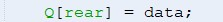
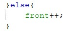
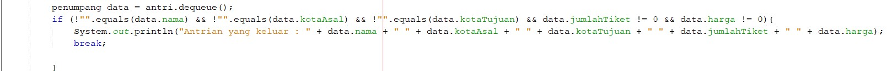
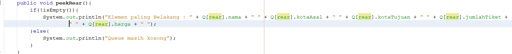
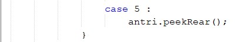
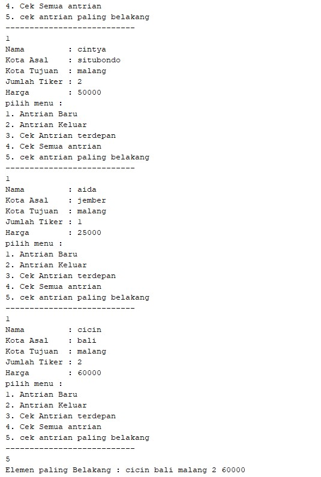

# Laporan Praktikum Pertemuan 10

## pertanyaan 8.2.3

1. karena array dimulai dari index ke-0, sehingga front dan rear diinisiasasi dengan nilai -1. 

2. maksud dari kode tersebut adalah apabila rear sudah beada pada max -1, maka jika ingin menambahkan data selanjutnya akan dimasukkan pada index ke-0

3. berada pada : 

4. berada pada :

5. maksud dari kode tersebut adalah apabila front sudah berada pada max -1, maka jika ingin menambahkan data selanjutnya akan dimasukkan pada index ke-0

6. karena posisi front atau data terdepan tidak selalu pada index kw-0, sedangkan perulangan dimulai dengan posisi frontnya

7. maksud dari kode tersebut adalah, nilai i(front) jika tidak berposisi sebagai rear, maka akan dilakukan penambahan pada variable tersebut lalu akan dimodulus dengan nilai max atau kapasitas dari Queue tersebut

## pertanyaan 8.3.3

1. fungsi kode program tersebut adalah digunakan untuk deklarasi objek dengan menggunakan konstruktor berparameter.

2. program eror, karena konstruktor yang digunakan adalah konstruktor berparameter, sehingga perlu diiskan nilai pada kurung tersebut.

3. terdapat pada : 

4. modifikasi program 

- method peekRear

- class cek antrian paling belakang

- hasil running 

