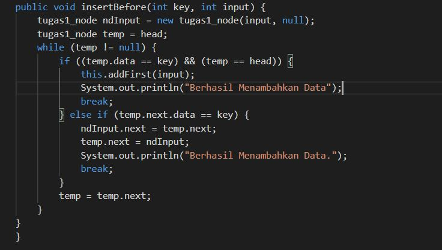
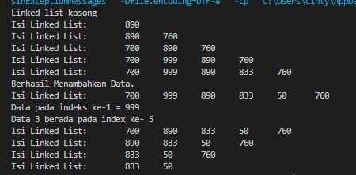

# Laporan Praktikum 11

## pertanyaan 9.2.3 

1. karena pada awal kode program langsung melakukan print dengan kondisi linkedlist belum terisi, sehingga pada saat di jalankan kode program akan menampilkan linked list kosong

2. ndInput.next = temp.next; --> untuk mengarahkan pointer data yang ingin dimasukkan menuju data setelah key(data selanjutnya dari data yang ingin di inputkan)
temp.next = ndInput; --> untuk mengganti pointer dari data sebelumnya dari data yang diinputkan menuju ke data yang baru saja di inputkan 

3. Kegunaan dari potongan kode tersebut yakni, jika temp.next.next tersebut bernilai null atau tidak ada, maka
tail atau posisi terakhir adalah temp.next.

## pertanyaan 9.3.3

1. fungsi remove yang digunakan syntak break artinya agar pada saat kode program sudah memenuhi syarat perulangan, perulangan akan dihentikan oleh syntax break. 

2. Kegunaan dari potongan kode tersebut yaitu ketika node yang ditunjuk memiliki data yang sama/equals
dengan key, maka terjadi perubahan posisi dimana node tersebut akan di gantikan dengan node yang
selanjutnya.

3. jika tmp==null maka akan mengembalikan nilai  -1 dan nilai dari variable index. Jika data
setelah temp tidak ada atau null maka akan dikembalikan nilai -1. Jika tidak maka akan
dikembalikan nilai index yang menandakan index ke berapa node tersebut

## Tugas 
1. penambahan method insertBefore
- 
    - hasil running 
- 

2. 