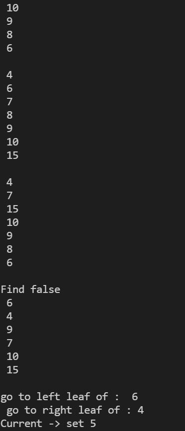
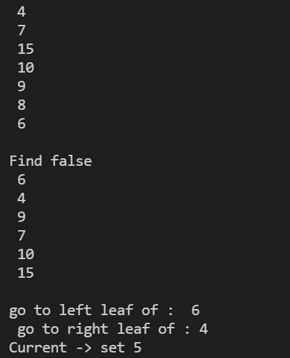
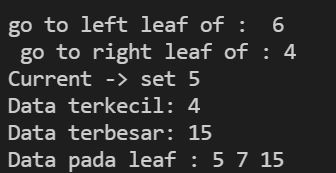
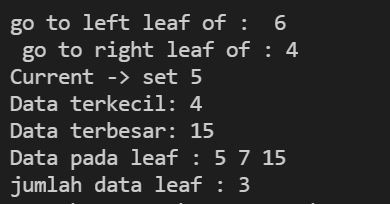

# Laporan Praktikum 14

## 13.2.2 pertanyaan percobaan

1. karena dalam binary seacr tree left-child harus lebih kecil daripada right-child dan parentnya, dimana hal tersebut dapat memudahkan dalam pencarian data. 

2. class node digunakan untuk menyimpan index. dimana lect untuk menyimpan index yang nilainya lebih kecil dari root sedangkan irght untuk menyimpan index yang nilainya lebih besar dari root. 

3. a. kegunaan atribut root dalam class BinaryTree adalah untuk menyimpan data yang pertama kali masuk 

   b. ketika objek tree pertama kali dibuat, nilai dari root adalah null

4. proses yang akan terjadi adalah proses add dimana node baru tersebut langsung masuk dan menjadi root dalam sebuah tree

5. Ketika data kurang dari current.data kemudian current.left tidak bernilai null maka
akan dilakukan current = current.left dan apabila current.left bernilai null maka
proses yang dilakukan current.left = new Node(data) atau penambahan node baru
dan break (berhenti)

## 13.3.2 Pertanyaan Praktikum

1. atribut data digunakan untuk menyimpan data array, sedangkan idxLast sebagai untuk menyimpan batas index

2. fungsi dari method populateDate() adalah untuk menyimpan data yang dimasukkan atau untuk menginisialisasi atribut data dan idxLast

3. fungsi dari method traverseInOrder() adalah untuk mencetak/menampilkan data dengan inOrder

4. Left child dari node tersebut akan berada di indeks 2i + 1. Right child dari node tersebut akan berada di indeks 2i + 2. Maka left child berada pada indeks ke 5 dan right child berada pada indeks ke 6

5. Fungsi dari statement int idxLast = 6 adalah menentukan batas untuk
melakukan print dengan batas index nya yaitu 6.

## Tugas Praktikum 

1. Buat method di dalam class BinaryTree yang akan menambahkan node dengan cara rekursif

- hasil running

2. Buat method di dalam class BinaryTree untuk menampilkan nilai paling kecil dan yang paling besar yang ada di dalam tree

- hasil running

3. Buat method di dalam class BinaryTree untuk menampilkan data yang ada di leaf

- hasil running

4. Buat method di dalam class BinaryTree untuk menampilkan berapa jumlah leaf yang ada di dalam tree.

- hasil running

5. Modifikasi class BinaryTreeArray, dan tambahkan :
- method add(int data) untuk memasukan data ke dalam tree
- method traversePreOrder() dan traversePostOrder()
