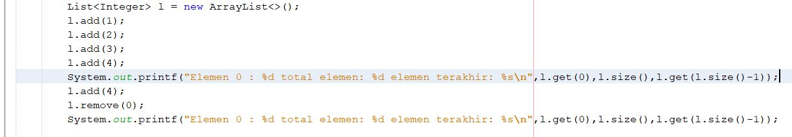
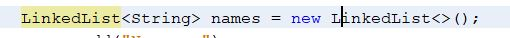
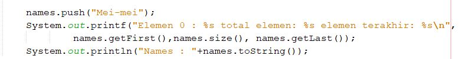
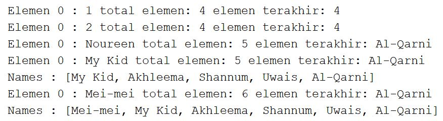
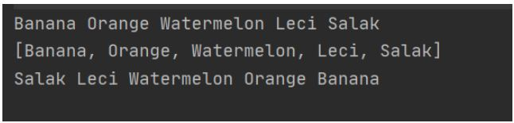
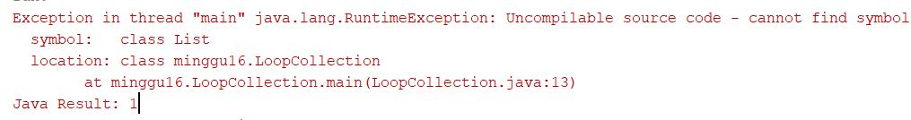
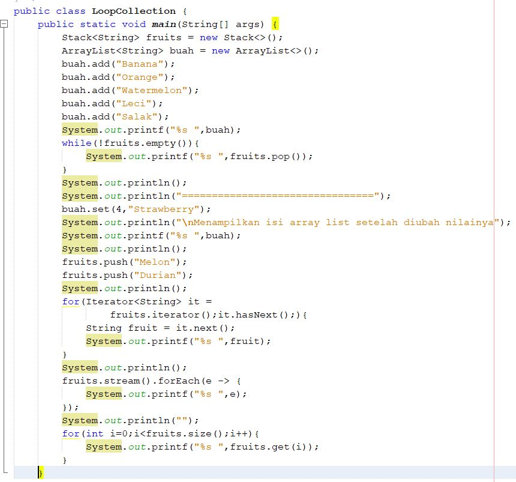
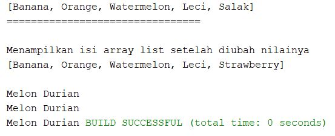
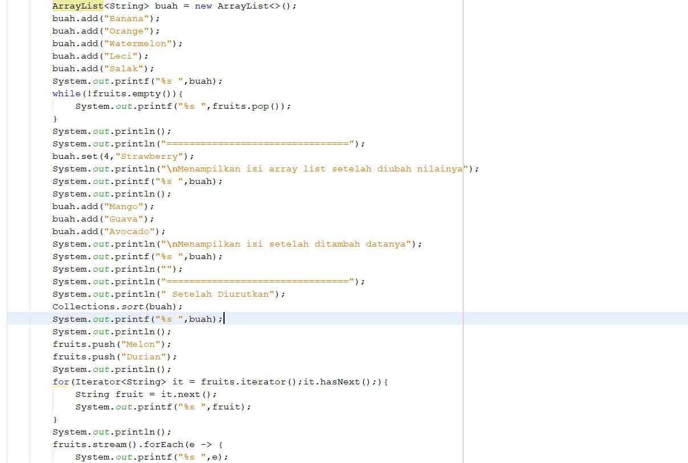
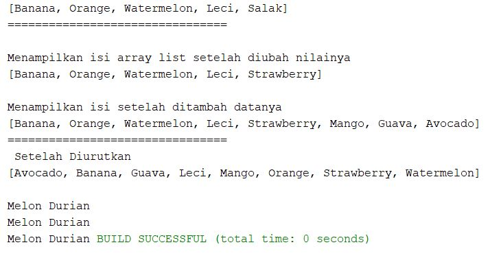

# Laporan Praktikum 16

## pertanyaan praktikum 16.2.3

1. karena arrayList menampung data secara dinamis sehingga seberapapun jumlahnya akan ditampung secara dinamis, arrayList digunakan dalam menyimpan data dalam bentuk objek, ArrayList juga dapat menyimpan sekumpulan data yang disimpan dalam satu kesatuan

2. modifikasi program

3. ubah kode program

4. penambahan kode 

5. hasil running 

penjelasan : akan terjadi penambahan data baru dan baris baru dengan nama Mei-Mei sehingga total elemen akan bertambah juga menajadi 6 dan untuk elemen terakhir tetap sama Al-Qarni, untuk urutan nama sendiri Mei-Mei menempati urutan pertama sebagai data terbaru yang diinputkan

## pertanyaan praktikum 16.3.3

1. perbedaan fungsi push() dan add() pada objek fruits adalah method push() biasa dgunakan untuk stack saja

2. 
data "Melon" dan "Durian"tidak ada. Karena saat kita mengakses fungsi push(). artinya kita akan menambahkan data "Melon" dan "Durian"

3. - baris 46 berfungsi sebagai inisialisasi dan kondisi untuk perulangan 
- baris 47 berfungsi pembuatan variable fruit sesuai urutan ditambahkannya data 
- baris 48 berfungsi untuk mencetak variable fruit sesuai urutannya 

4. yang akan terjadi adalah eror karena pada class tersebut belum terdapat interface List, sedangkan yang digunakan sebelumnya yaitu interface stack maka dari itu terjadi ketidaksinambungan. 
 

5. mengganti elemen terakhir dari objek "Strawberry"
 - kode program
  

  - hasil running 
   

6. - menambahkan 3 buah elemen 

- hasil running

## pertanyaan praktikum 16.4.3
1. Kelebihannya yaitu dapat mengambil argument tanpa batas tertentu dan memiliki parameter lebih dari satu
2. 
3. 

