# Jawaban Soal Jobsheet 3! 

## 3.2.3 pertanyaan
1. class yang akan dibuat Arrayy of object harus memiliki atribut, karena atribut dibutuhkan untuk mengisi nilai Array. dan untuk method tidak harus memiliki method terbukti pada percobaan 3.2.1 tanpa method tetap berjalan. untuk menampilkan panjang dan lebar bisa dilakukan di main class

2. pada class persegiPanjang tidak memiliki konstruktor, dilakukan pemanggilan kosntruktor tersebut untuk pembuatan objek pada ppArray index ke-1

3. yang dimaksud dari kode tersebut adalah untuk mendeklariskan array persegiPanjang yang memiliki panjang 3

4. yang dimaksud kode tersebut adalah untuk mengisikan nilai panjang dan lebar pada sebuah array persegi panjang index ke-1. 

5. karena agar konsep objek yang kita lakukan adalah jelas dan dapat mudah dipahami. 

## 3.3.3 pertanyaan

1. array of object dapat diimplementasikan ke array 2 Dimensi.

2. contohnya

    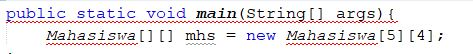

3. akan memunculkan eror karena tidak terdapat objek index ke-5. maka harus membuat objek terlebih dahulu agar tidak eror.

4. modifikasi program agar length arrray menjadi inputan Scanner

                -kode modifikasi 
    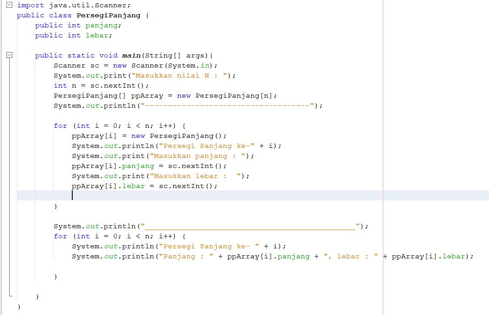 

                - hasil Running
    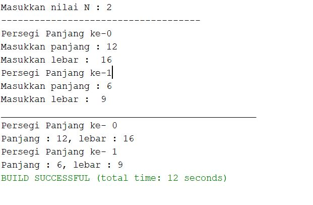
5. boleh jika terjadi duplikasi instansiasi array of objek, karena tidak berpengaruh tetapi nantinya nilainya akan sama

## 3.4.3 pertanyaan

1. dapat , jumlah parameter atau jenis konstruktornya berbeda. Contoh ,
membuat konstruktor dengan parameter alas dan tinggi segitiga,dan konstruktor default untuk
menghitung luas segitiga
2. Diketahui terdapat class segitiga 
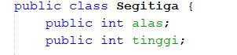

3. menambahkan konstuktor pada class segitiga
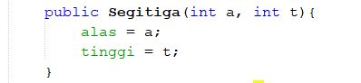

4. menambahkan method pada class segitiga
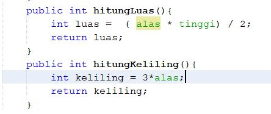

5. buat Array segitga sgArray berisi 4 elemen

    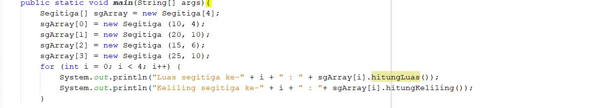
        --

                -hasil output

    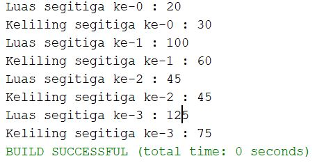

## 3.5 Latihan Praktikum
1.      -- kode class balok

    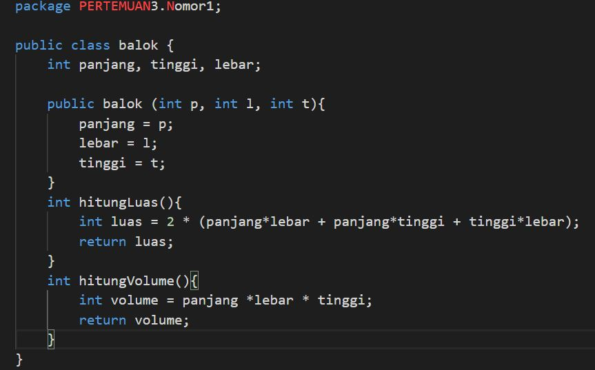

        -- kode class kubus

    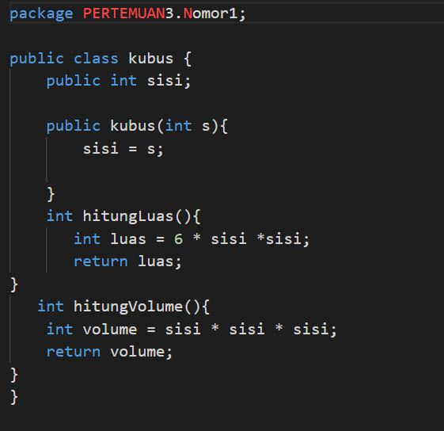

        -- kode class bola

    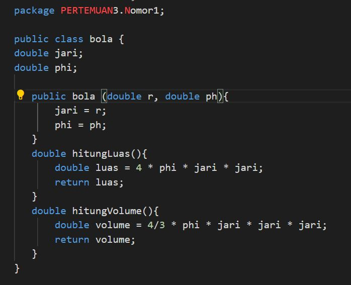

        -- kode class main

    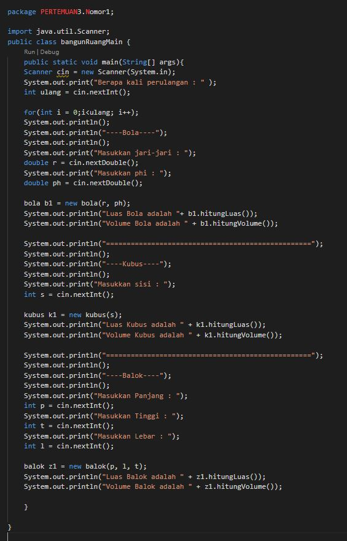

        --kode output main

    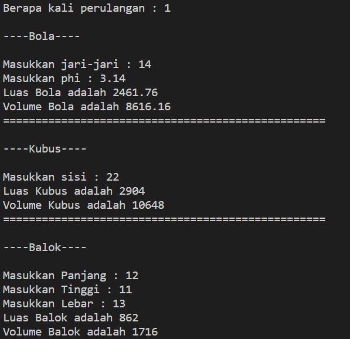

2.      --kode class tanah 

    

        --kode class main

    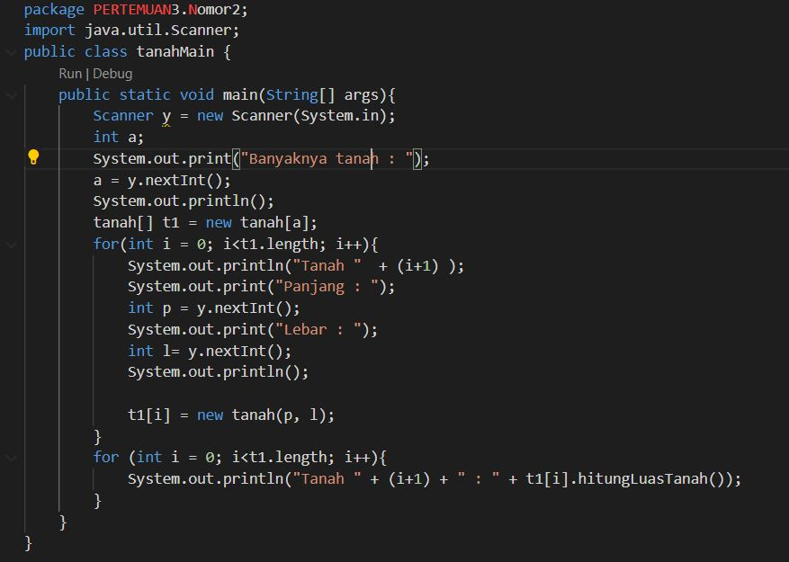

        --kode output main

    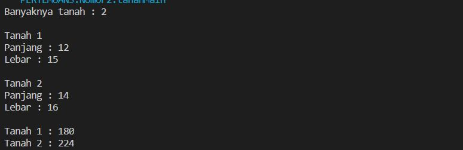 

3.      --kode class tanah 

    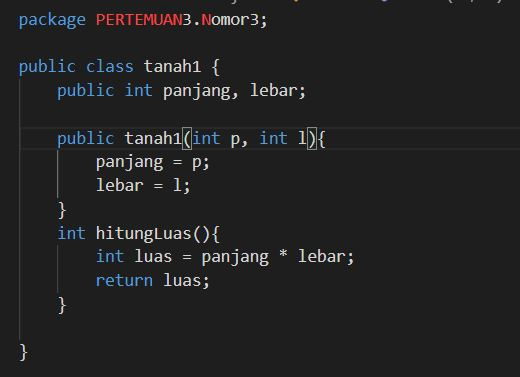

        --kode class main

    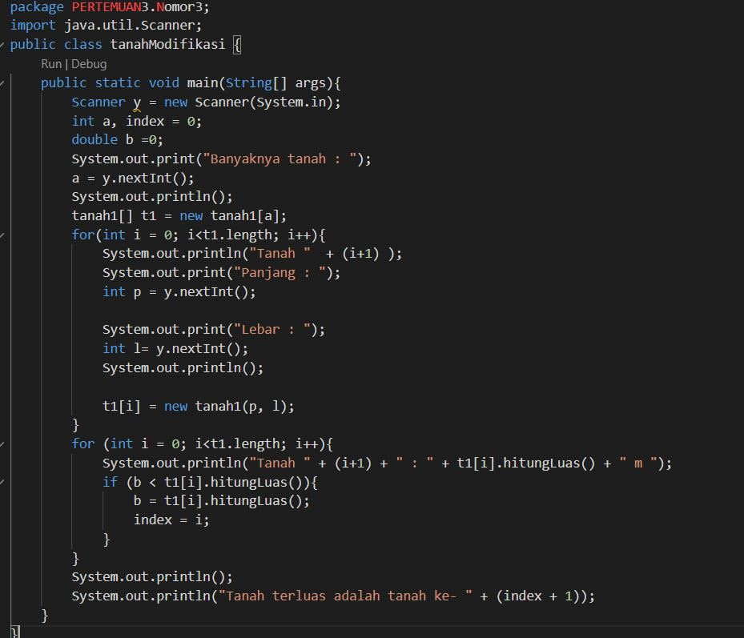

        -- kode ouput main

    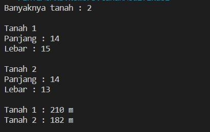

4.      --kode class mahasiswa 

    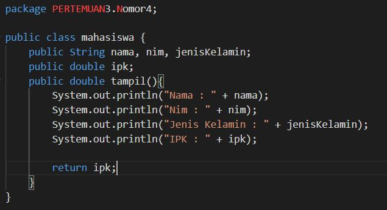

        -- kode class main

    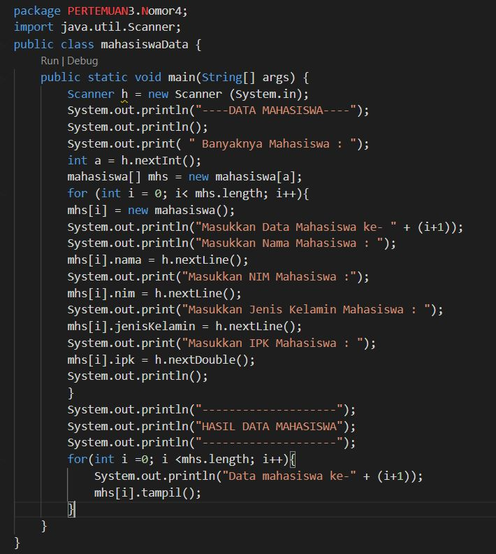

        -- kode output main

    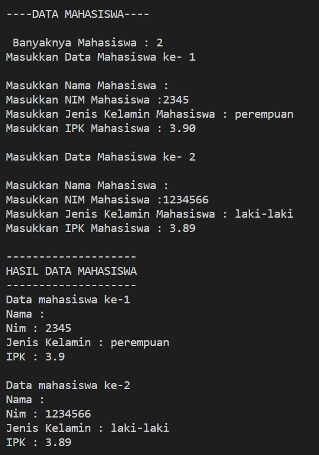

5.      -- kode class mahasiswa 

    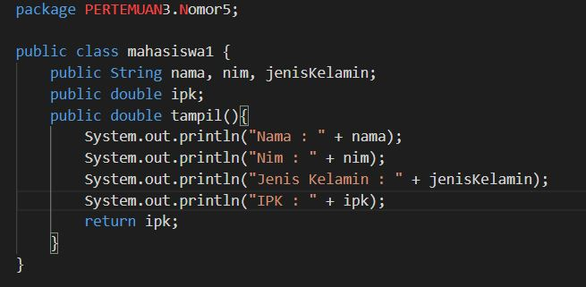

        -- kode class main

    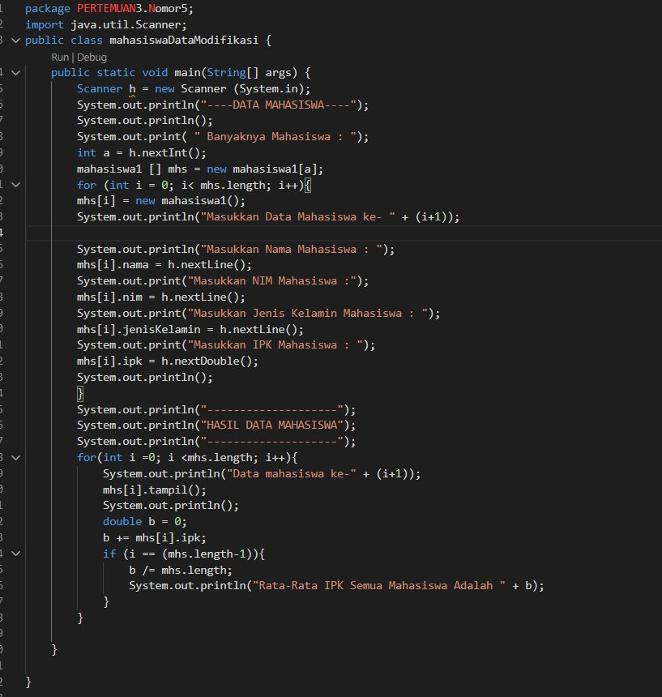

            -- kode output main

    