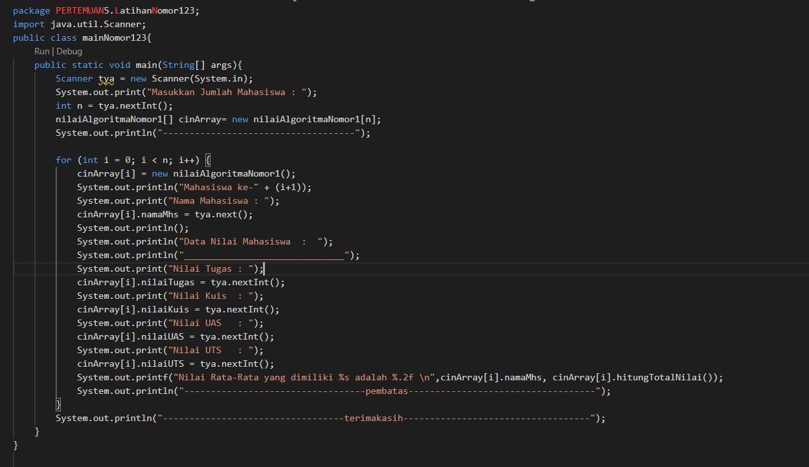

# PRAKTIKUM 5

## 4.2.3 Pertanyaan

1. base line Algoritma Divide Conquer untuk melakukan Pencarian nilai faktorial adalah apabila nilai dari n sudah equals atau sama dengan 1, maka program akan melakykan return 1, kemudian jika tidak maka nilai daripada variable n akan dikurang -1, yang mana disetiap loop atau perulangan yang dilakukan pada method dikalikan dengan nilai sebelumnya dan kemudian program akan mereturn pada variable fakto. atau bisa disebut divide Conquer menggunakan cara perhitungan fungsi rekursif

2. untuk 3 tahapan pada algoritma divide dan conquer yaitu : 
    - divide = faktorialDC(n-1) pengurangan pada nilai n atau membagi masalah menjadi beberapa upa-masalah yang memiliki kemiripan dengan masalah semula namun berukuran lebih kecil
    - conquer = n*faktorialDC(n-1) penyelesaian dengan rekursif
    - combine =  n*faktorialDC(n-1) pengombinasian dengan perkalian atau menggabungkan solusi masing-masing upa-masalah sehingga membentuk solusi masalah semula
3. pada method faktorialBF() dapat dirubah perulangannya yang semula menggunakan for bisa juga menggunakan perulangan jenis while maupun do while
contohnya : 

    --> kode program modifikasi 

    --> hasil running 

4.  kode program pengecekan waktu eksekusi

    --> hasil running pengecekan waktu

5. Hasil running pengecekan waktu diatas 20 angka

## 4.3.3 pertanyaan
1. perbedaan 2 method pangkatBf() dan pangkatDC()
- method pangkatBf yakni menggunakan fungsi iterative(fungsi yang melakukan perulangan, dilakukan dalam batasan syarat tertentu, jika syarat tersebut tidak terpenuhi maka perulangan akan berhenti), proses penghitungan/hasil yang didapat dari rumus (hasi = hasil * a)

- method pangkatDC yakni menggunakan fungsi rekursif(perulangan yang terjadi akibat pengeksekusian suatu fungsi yang mana fungsi tersebut memanggil dirinya sendiri)

2. arti dari potongan kode tersebut adalah  apabila terdapat suatu bilangan ganjil maka program akan melakukan
pembagian terhadap variuable n, yakni di bagi 2 kemudian dikalikan dengan method itu sendiri dan kemudiankalikan lagi dengan variable a. namun apabila terdapat suatu bilangan genap maka program akan melakukan return/nilai balik dan di dalam return tersebut dilakukan pembagian terhadap variable n, yang mana variable n di bagi 2 dan kemudian di kalikan dengan method itu sendiri namun tidak dikalikan dengan nilai daripada variable a.

3. tahap combine sudah terjadi pada kode tersebut dan lebih tepatnya tahapan tersebut dilakukan pada class pangkat yang mana lebih tepatnya terletak pada method pangkatDC. dan ditunjukkan oleh gambar di bawah ini terdapat pada line ke-30

4. modifikasi proses pengisian atribut dilakukan dengan konstruktor

--> kode program modifikasi 

--> hasil running program 

5. menambah menu agar salah satu method yang terpilih

--> kode program tambah menu 

--> hasil running program 

## 4.4.3
1. perbedaam perhitungan keuntungan dengan method TotalBF() ataupun totalDC

    --> jika menggunakan perhitungan keuntungan dengan menggunakan method totalBf yakni kode program terkesan lebih ringkas dan sederhana dan menghasilkan algoritma baku(standard)untuk tugas seperti penjumlahan atau perkalian n buah bilangan dan menentukan elemen minimum atau maksimum
    
    --> jika menggunakan perhitungan keuntungan dengan menggunakan method totalDC yakni dapat memecah masalah atau case yng sulit kemudian memiliki efisiensi yang tinggi dalam menyelesaikan algoritma sortingdan juga pada method ini memiliki sistem kerja pararel. 

2. dengan cara mengganti syntax println menjadi syntax printf dan juga teknik pembatasan karakter, seperti di bawah ini : 

    System.out.printf("%2f", "Total keuntungam selama "+sm.elemen+" bulan adalah : "+sm.totalBF(sm.keuntungan));

3. return value tersebut berguna untuk mengembalikan nilai dari variable isum, varibale rsum[mid], dimana masing-masingnya dijumlahkan terlebih dahulu 

4. dibutuhkan variable mid pada method totalDC() yakni guna menampung nilai dari perhitungan (1+r)/2, dimana nantinya akan digunakan sebagai pengisian nilai pada parameter di method TotalDC() atau bis digunakan untuk membagi elemen menjadi beberapa bagian 

5. --> kode program 
    

 

    

## Latihan soal 
1. --> kode program 

2. --> kode program

    

    -->Hasil running 

    

3. -->kode program class

    

-->kode program main
    

-->Hasil running 

4. -->kode program class

    

    --> kode program main
    

    -->Hasil running 

    