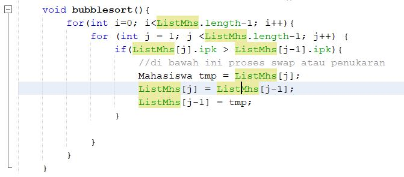
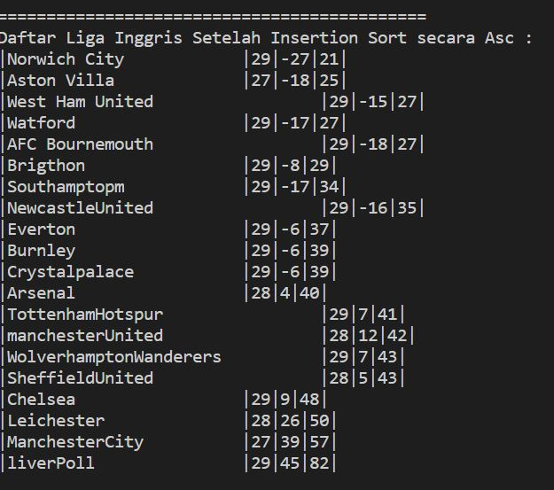

# PRAKTIKUM 6

## 5.2.3 pertanyaan

1. method proses bubble sort terdapat pada method bubbleSort(), pada class DaftarMahasiswaBerprestasi pada line ke-34 sampai line ke-46

2. method proses selection sort tidak ada pada praktikum 5.2.1

3. proses swap adalah proses dimana membandingkan serta menukarkan/mengurutkan data pada proses sorting hingga selesai. 
untuk potongan program swap terdapat pada class DaftarMahasiswaBerprestasi pada line ke-39 sampai line ke-42

4. pada method bubbleSort(), terdapat baris program seperti dimodul, proses tersebut pada line ke 27 adalah proses membandingkan 2 nilai baris, dan untuk line ke 28-34 untuk melaukan proses swap apabila nilai yang akan dibandingkan belum terurut dari yang terkecil, sehingga proses swap dilakukan

5. a. perbedaan kegunaaan perulangan i dan perulangan j
--> perulangan i digunakan untuk looping sebanyak ListMhs.length-1 atau looping jumlah elemen array
--> perulangan j digunakan untuk proses swap/penukaran nilai yang bertujuan untuk mengurutkan nilai dari yang terkecil ke terbesar dalam proses bubble sort

    b. karena pada perulangan i, diberikan jumlah atau elemen mahasiswa dinyatakan dalam bentuk array. kemudian digunakan kode seperti di line 27 karena panjang dari ListMhs yakni 5, dan dikurang 1 agar memunculkan elemen sebanyak 5.

    c. karena jumlah elemen mahasiswa dinyatakan dalam bentuk array sehingga untuk menentukan jumlah tahap bubble sort agar dilakukan program maka syaratnya harus dilakukan, disini bertujuan untuk menampilkan bahwa tahapan dilakukan sebanyak j<5-0, atau sama artinya taapan bubble sort pada program dengan jumlah elemen 5 ditempuh sebanyak 4 kali

    d. jika ListMhs adalah 50, maka perulangan i akan diulang sebanyak 48 kali, karena i memiliki nilai 0. Kemudian patokan dari loop tersebut yakni i < listMhs.length -1 . nah jika listMhs di beri nilai elemen 50 maka penjabarannya menjadi : i = 0 listMhs = 50 elemen – 1 (49 elemen)
    perhitungan = 50 elemen di -1 , maka hasilnya yakni 49 elemen. Kemudian patokan yang di gunakan yakni i < 49 maka hasilnya yakni 48 elemen. Jadi jumlah elemen saat ini menjadi 49 index maka perulangan di lakukan sebanyak 49 kali. sedangkan untuk tahap bubble short di lakukan sebanyak 49 tahap 1225 kali perulangan. 
## 5.3.3 pertanyaan
1. proses tersebut digunakan untuk melaukan pengurutan suatu nilai dari terkecil ke terbesar atau Ascending, adapun alur dari kode program tersebut adalah 
    
    --> pada program tersebut dilakukan inisialisasi terhadap variable idxMin serta diberikan nilai idxMin equals dengan i. variabel idxMin digunaka untuk menampung nilai minimal yang ditentukan pada perbandingan
   
    --> kemudian dilakukan perbandingan yang terjadi pada loop, dimana perulangan dilakukan sebanyak ListMhs.length
   
    --> lalu diperulangan tersebut dilakukan perbandingan, dimana jika ipk pada Array ListMhs ke j lebih kecil dari nilai ipk yang terdapat pada array ListMhs ke idxMin maka idxMin akan menyimpan nilai yang terdapat pada variable j. dengan begitu proses swap akan dilakukan, mengurutkandari nilai terkecil atau nilai minimum 

## 5.4.3
1. --> kode program untuk insertionSort Ascending

--> hasil running program

## 5.5.3 Latihan Soal
1. --> kode program tiket

--> kode program tiketService

--> kode program mainTiket

2. --> kode program
--> kode Premierleague

--> kode PremiertLeagueService

--> kode mainLeague

--> hasil running program
    --> sebelum disorting
    

--> setelah disorting menggunakan asc
    

--> setelah disorting menggunakan dsc
    