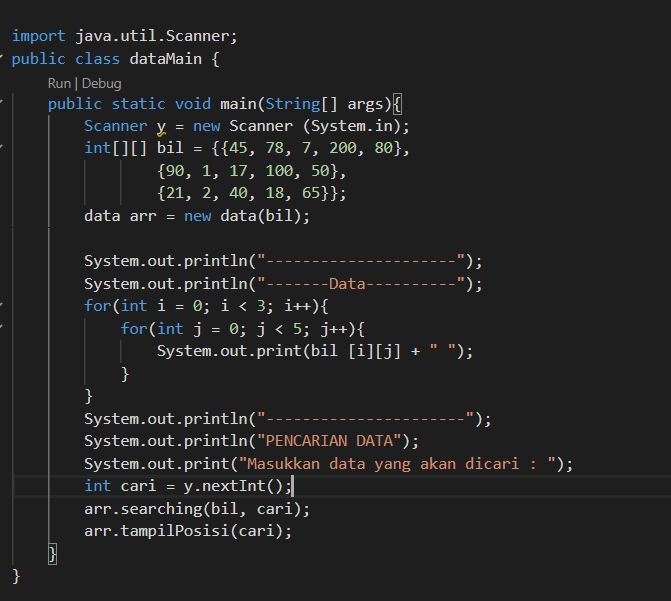
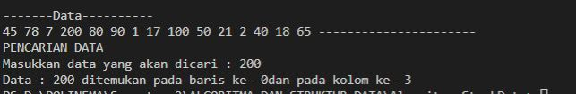
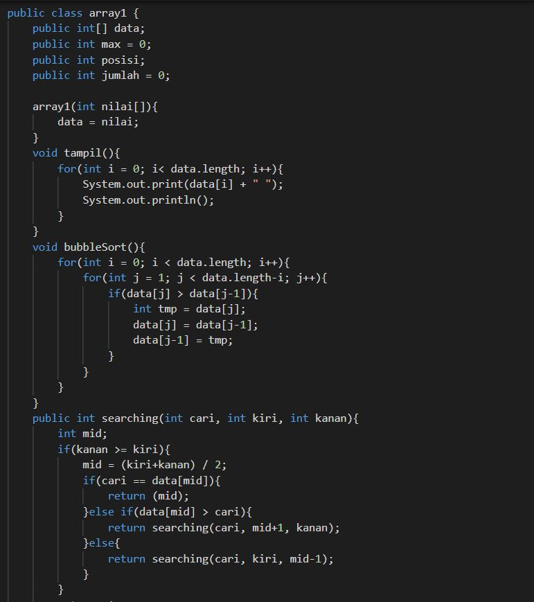

# Laporan Praktikum Pertemuan ke-7!

## 6.2.3 pertanyaan 

1. perbeddan method tampilData dan TampilPosisi 

    - method tampilData
    
    method tampilData digunakan untuk menampilkan print data seperti hal nama, NIM, umur dan IPK. 
    
    - method tampilPosisi 

    method tampilPosisi digunakan untuk mencari tahu lokasi data yang dicari. dimana jika data ada maka akan akan dilakukan printout berupa letak index keberapa data tersebut

2. fungsi break pada kode program adalah untuk melakukan penghentian/ stop suatu program ketika program berhasil menemukan nilai yang dicari. sehingga apabila ListMhs[j].nim equals dengan variable yang dicari sudah cocok/ditemukan, maka break berperan supaya perulangan/pencarian data dihentikan. 

3. program akan tetap berjalan, hasil yang dikeluarkan akan tetap benar. karena pada praktikum 1 kita menggunakan metode sequential search, dimana data tidak perlu terurut terlebih dahulu.

## 6.3.3 pertanyaan 
1. proses devide dijalanlan terdapat pada kode baris ke-61 dan 62

    

2. proses conquer dijalankan terdapat pada kode baris ke-
65, 66, 67

3. program masih bisa berjalan, namun data yang dicari berada ditengah maupun diakhir maka data tersebut tidak akan ditemukan karena pada metode binary search mengharuskan data melakukan tahap sorting terlebih dahulu sehingga proses metode binary dapat di lakukan 

4. hasil pada binary search sebelum di modifikasi seperti dibawah ini, data tidak ditemukan 

    

        --lalu ketika kode program diubah, seperti dibawah ini 
    

        -- hasil running 
     

5.  modifikasi kode program agar inputan dari keyboard

        --kode class mahasiswa 
    

        -- Kode mainclass mahasiswa 
    

        -- hasil running 
    

## 6.4.3
1. -- kode class mahasiswa

    --Kode class pencarianMhs

    --Kode mainclass mahasiswa

    -- hasil running 

 

2. -- kode class mahasiswa

        --kode class pencarianMhs

    
        --kode main class mahasiswa

        --hasil running

3. -- kode class data

--Kode main class data 

--kode hasil running

4.  -- kode class array1

--Kode main class array1

--kode hasil running 

