# Laporan Praktikum 7.2

## pertanyaan 7.2.3
1. fungsi potongan kode program tersebut adalah untuk memberi tahu stack memiliki size sebesar 5 elemen

2. penambahan data ke stack 

- kode program
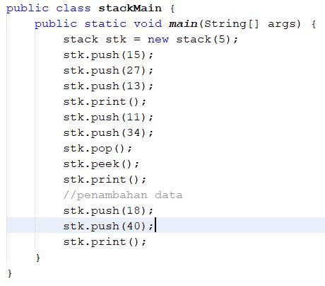

- hasil running 
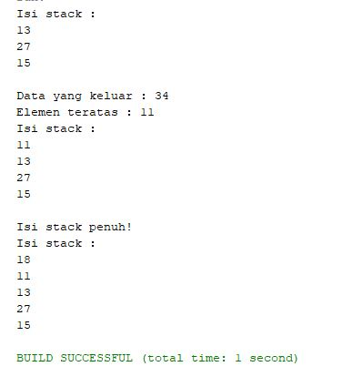

3. karena elemen stack sudah penuh yakni, hanya memuat 5 elemen sedangkan data yang ada ada 6 sehingga data angka 40 tidak dimasukkan. 

## pertanyaan 7.3.3

1. data yang disimpan pada variable bk, yaitu data yang dimasukkan menggunakan Scanner

2. potongan kode menunjukkan kapasitas penampungan kode 
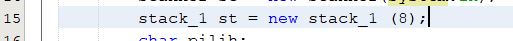

3. fungsi penggunaan do-while adalah untuk melakukan perulangan untuk user, agar melakukan inputan data. maka akan ditanyai ingin memasukkan data lagi atau tidak

4. modifikasi program agar menggunakan inputan user pada pemilihan menu stack 

- kode program 
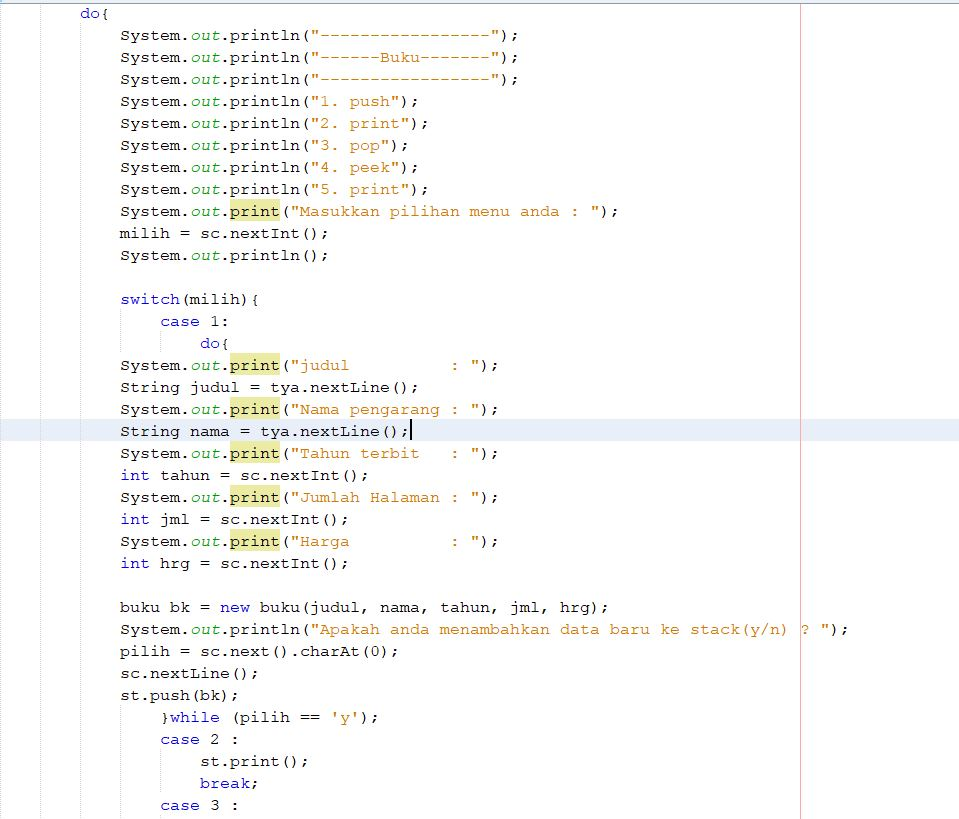

- hasil running 
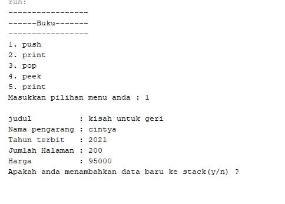

## pertanyaan 7.4.3

1. alur kerja method derajat adalah ketika operator tersebut adalah ‘^’ maka akan mereturn 3, jika operatornya
‘*, /, dan %’ maka akan mereturn nilai 2, sedangkan operatornya adalah ‘+, -‘ maka akan mereturn nilai 1

2. fungsi kode program tersebut yakni digunakan untuk setiap karakter yang dimasukkan akan dicek satu persatu
dan selanjutnya akan dipisahkan antar operand dan operator, dan notasi postfix akan dilakukan.
Variabel c digunakan untuk menampung karakter karakter tersebut

3. 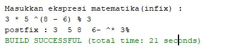

4. karena ketika terdapat tanda kurung pada ekspresi matematika, maka tanda kurung tersebut akan langsung di
pop tanpa dimasukkan kedalam postfix.

## tugas Praktikum 

1. - kode program 

- class tugas1
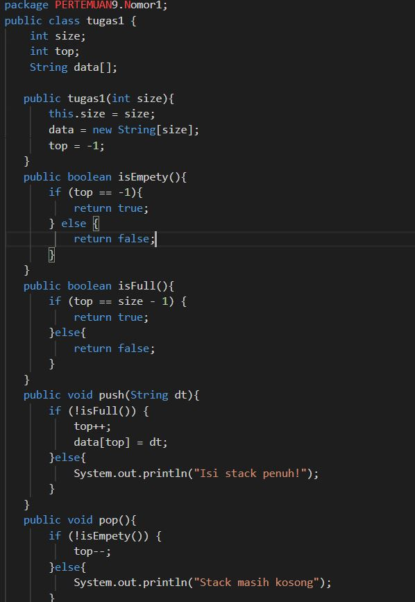

- main tugas 1
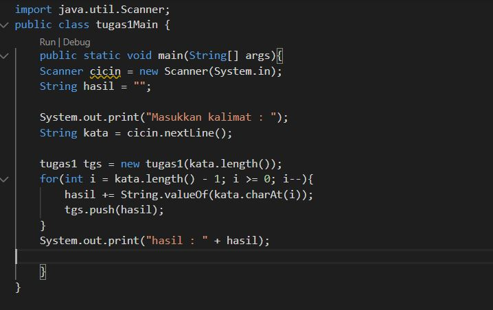

- hasil running 
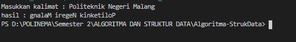

2. - kode program 

- class tugas2
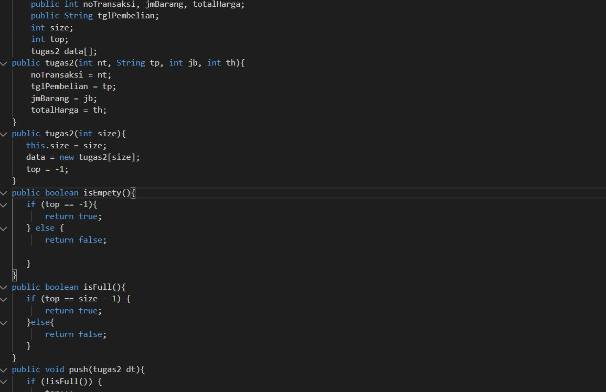

- main tugas 2
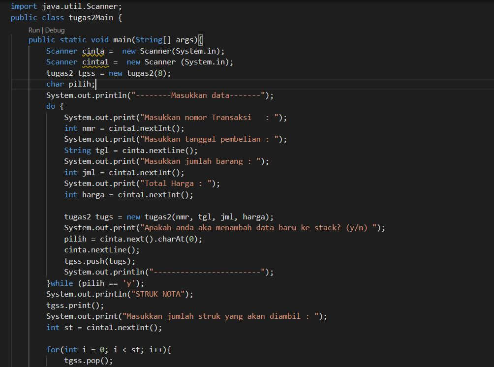

- hasil running 
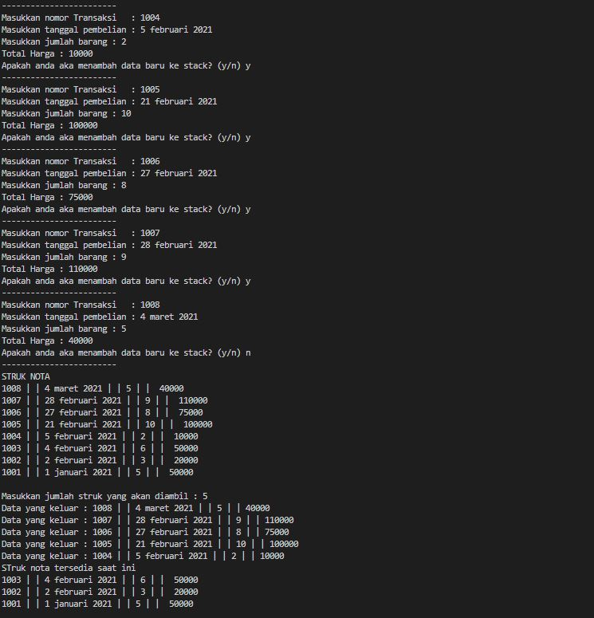

